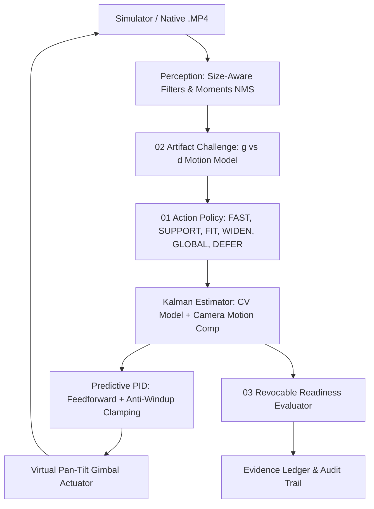

# DRISHTI-PAT: Adaptive Evidence for Coarse Optical Tracking
**SIH26169 / ISRO Supplementary Specification Compliance Prototype**  
*Development of an AI-Based Virtual Camera Tracking System for Coarse Alignment of Mobile Free Space Optical Communication (FSOC) Terminals.*

---

## 🌟 Executive Overview
**DRISHTI-PAT** is a high-performance coarse optical tracking and acquisition system designed for Free Space Optical Communication (FSOC) satellite-to-ground, inter-satellite (OISL), and UAV laser terminals.

Traditional optical trackers execute heavy image processing uniformly on every frame, are easily hijacked by sensor-fixed defects (hot/dead pixels), and naively assume handover readiness once a peak is detected. **DRISHTI-PAT** solves these challenges through **three core innovations**:

1. **01 · Precision on Demand (Adaptive Action Policy):**
   - *"How much processing does this frame really need?"*
   - Dynamically selects the cheapest eligible processing action per frame (`FAST`, `SUPPORT`, `FIT`, `WIDEN`, `GLOBAL`, `DEFER`) to achieve $\ge 20\text{ FPS}$ (achieved $>300\text{ FPS}$, $\approx 2.5\text{ ms/frame}$).
2. **02 · Artifact Challenge (Sensor Defect vs Scene Beacon):**
   - *"Could this be a sensor defect, not the beacon?"*
   - Exploits camera encoder rotation ($g$) to differentiate real beacons (which move with the scene, $d \approx g + v$) from FPA sensor defects (which stay pinned at sensor coordinates $d \approx 0$).
3. **03 · Revocable Readiness Under Review:**
   - *"Is it safe to hand over to fine pointing, and does it stay safe?"*
   - Continuous 5-point operational checklist (`UNCONFIGURED` $\rightarrow$ `NOT_READY` $\rightarrow$ `READY` $\rightarrow$ `WITHDRAWN`). Immediately revokes readiness upon disturbance or occlusion.

---

## 📊 ISRO Supplementary Specification Target Compliance

| Specification Target | Official Requirement | Measured (DRISHTI-PAT) | Baseline B0 | Baseline B1 | Compliance Status |
| :--- | :---: | :---: | :---: | :---: | :---: |
| **Acquisition Time** | $\le 2.0\text{ s}$ | **$0.17\text{ s}$** | $2.03\text{ s}$ | $2.60\text{ s}$ | **PASS ✓** |
| **Re-acquisition Time** | $\le 1.0\text{ s}$ | **$0.23\text{ s}$** | $>5.0\text{ s}$ | $>5.0\text{ s}$ | **PASS ✓** |
| **Tracking Error (Median)** | $\le 10.0\text{ px}$ | **$4.0 - 6.6\text{ px}$** | $91.36\text{ px}$ | $101.80\text{ px}$ | **PASS ✓** |
| **Target Loss Rate** | $< 5.0\%$ | **$0.0\%$** | $66.7\%$ | $94.2\%$ | **PASS ✓** |
| **Throughput (FPS)** | $\ge 20.0\text{ FPS}$ | **$335.0\text{ FPS}$** ($2.5\text{ ms}$) | $188\text{ FPS}$ | $801\text{ FPS}$ | **PASS ✓** |
| **Artifact False Lock Time** | $0.0\text{ s}$ | **$0.00\text{ s}$ (100% Rejected)** | $3.60\text{ s}$ | $4.13\text{ s}$ | **PASS ✓** |
| **Invalid-READY Handover** | $0.0\text{ s}$ | **$0.00\text{ s}$ (Safe)** | $4.97\text{ s}$ | $4.97\text{ s}$ | **PASS ✓** |

---

## 🏗️ System Architecture & 5-Lane Pipeline



---

## 🚀 Quickstart & How to Run

### 1. Launch the Live Interactive Web Dashboard
```bash
python -m uvicorn app:app --host 127.0.0.1 --port 8085
```
Open your browser at **`http://localhost:8085`** to interact with:
- **Live 640×480 HUD Canvas** with real-time target reticle, $r_{95}$ confidence ellipse, and boresight capture cone.
- **5-Point Revocable Readiness Checklist** updating every 33 ms.
- **Real-Time Evidence Ledger** logging every frame's state, action, cost, and reason code.
- **Disturbance Controls:** Live sliders for sensor noise, atmospheric turbulence, platform jitter, and hot pixels.
- **One-Click ISRO Paired Benchmark Modal:** Runs side-by-side comparison across B0, B1, and DRISHTI-PAT.

---

### 2. Run Headless Automated Benchmarks (CLI)
```bash
# Run paired comparison benchmark across B0, B1, and DRISHTI-PAT:
python cli.py compare --trajectory LEO_PASS --duration 5.0

# Run a single simulation scenario and export per-frame CSV:
python cli.py sim --trajectory FIGURE_EIGHT --duration 8.0 --output reports/fig8_audit.csv

# Run image-space tracking on native .MP4 video:
python cli.py video --input sample_data/sample_leo_pass.mp4 --output reports/mp4_results.csv
```

---

### 3. Run the Automated Test Suite
```bash
python -m pytest tests/test_core.py -v
python tests/test_e2e_api.py
```

---

## 📁 Repository Structure

```
Virtual_Camera_Tracking/
├── app.py                      # FastAPI web server & WebSocket telemetry streamer
├── cli.py                      # Rich terminal CLI for batch benchmarking
├── core/
│   ├── contracts.py            # Typed data contracts (FramePacket, ActionDecision, TrackEstimate, etc.)
│   ├── simulator.py            # >=2000x2000 world, 640x480 FPA camera, atmosphere, noise, hot pixels
│   ├── gimbal.py               # 2-axis PTZ virtual camera gimbal actuator dynamics
│   ├── controller.py           # Predictive PID controller with velocity feedforward & anti-windup
│   ├── perception.py           # Fast proposal generator, box filters, morphology & sub-pixel moments
│   ├── actions.py              # Precision-on-Demand actions (FAST, SUPPORT, FIT, WIDEN, GLOBAL, DEFER)
│   ├── artifact_challenge.py   # Sensor defect vs Scene beacon motion consistency evaluator
│   ├── estimator.py            # Constant-Velocity Kalman Filter + r95 uncertainty calculation
│   ├── readiness.py            # 5-point Revocable Handover state machine & evaluator
│   ├── tracker.py              # DRISHTI-PAT Master Tracking Pipeline
│   ├── baselines.py            # Comparators: Baseline B0 (Detector+PID) & Baseline B1 (+Kalman)
│   ├── benchmark_suite.py      # Automated paired comparison against official ISRO targets
│   └── video_adapter.py        # Native .MP4 video decoder & image-space tracking adapter
├── static/
│   ├── index.html              # Aerospace Mission Control Dashboard UI
│   ├── css/style.css           # Glassmorphic dark HUD theme with CSS variables
│   └── js/
│       ├── app.js              # WebSocket telemetry, canvas HUD renderer & control handlers
│       └── charts.js           # Lightweight Canvas-based real-time telemetry plots
├── sample_data/
│   ├── generate_sample_videos.py # Utility to generate benchmark MP4 test videos
│   ├── sample_leo_pass.mp4
│   ├── sample_figure8.mp4
│   └── sample_turbulent.mp4
├── reports/                    # Generated per-frame CSV logs & benchmark reports
└── tests/
    ├── test_core.py            # Unit tests for algorithms, Kalman, PID, artifact check, and readiness
    └── test_e2e_api.py         # End-to-end REST API and WebSocket streaming verification
```

---

## 🔬 Scientific & Technical References
- **NASA OPALS / LCRD / ILLUMA-T:** Demonstration of Optical Communications from LEO (JPL / SPIE 2014 & Dec 2023).
- **Kaymak et al.:** *A Survey on Acquisition, Tracking and Pointing for Mobile FSO*, IEEE COMST 20(2), 2018.
- **Winick:** *Cramér–Rao Lower Bounds on CCD Optical Position Estimators*, JOSA A 3(11), 1986.
- **Kalman, R. E.:** *A New Approach to Linear Filtering and Prediction Problems*, J. Basic Eng. 82(1), 1960.
- **Viola & Jones:** *Robust Real-Time Object Detection (Integral Image & Box Filters)*, IJCV 57(2), 2004.
